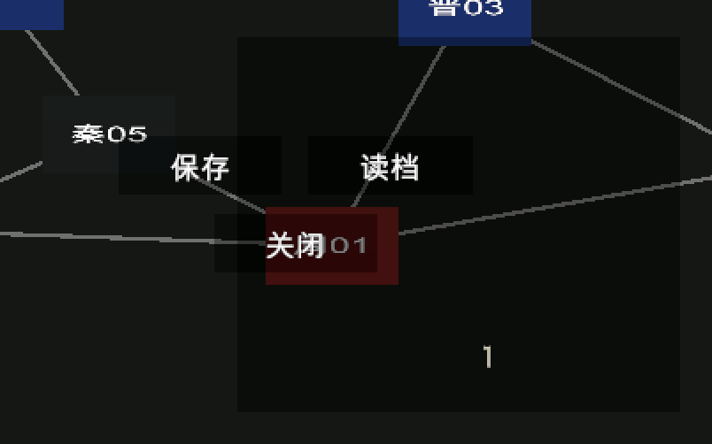
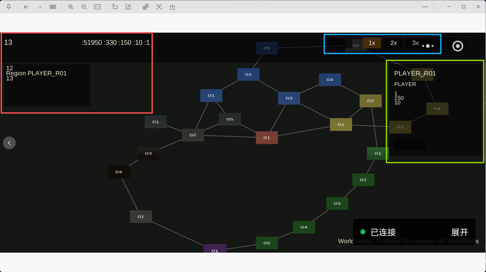
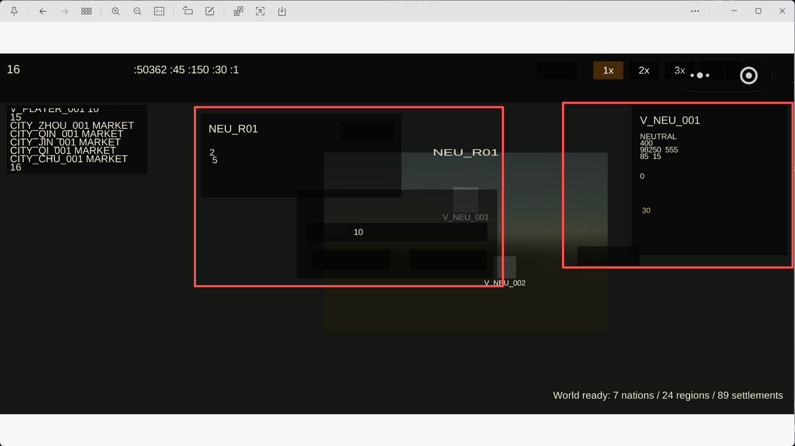
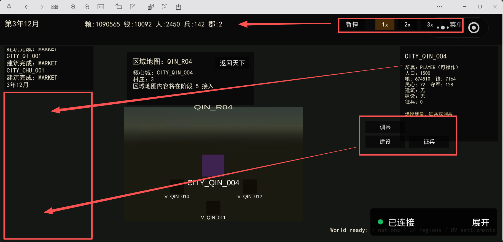

# 验收

1. 区域地图界面：上侧的地图显示区域，右侧的操作区域，特别是左侧日志入区域太大，遮挡了地图，可以缩小点；✅
2. 没有看到民心值在哪里显示？✅
3. 还没有取消派兵限制？改成可以全部派出士兵；✅
4. 没有显示农田等级，看到不农田属性和作用，每次点击建设都能生效，建设成功后，也看不到农田信息；✅
5. 游戏没有结束判定：；✅
6. 读档后，日志和顶部的数据显示异常；；✅
7. 菜单弹窗里的弹窗没有居中，保存按钮偏离到弹窗框的外面去了；✅
微信小程序验收
1. 左侧日志文案汉字不显示，顶部不显示汉字，暂停，菜单，天下地图势力点击后右侧操作区 汉字不显示，区域地图返回天下地图菜单， 进攻据点列表，进攻军队输入菜单；，✅
2. 区域地图布局调整：顶部的文案 和 按钮区往左移动，避免被微信小游戏设置按钮挡住；村庄操作菜单放置到左侧日志区下面，三个按钮也放入到村庄菜单内部✅
